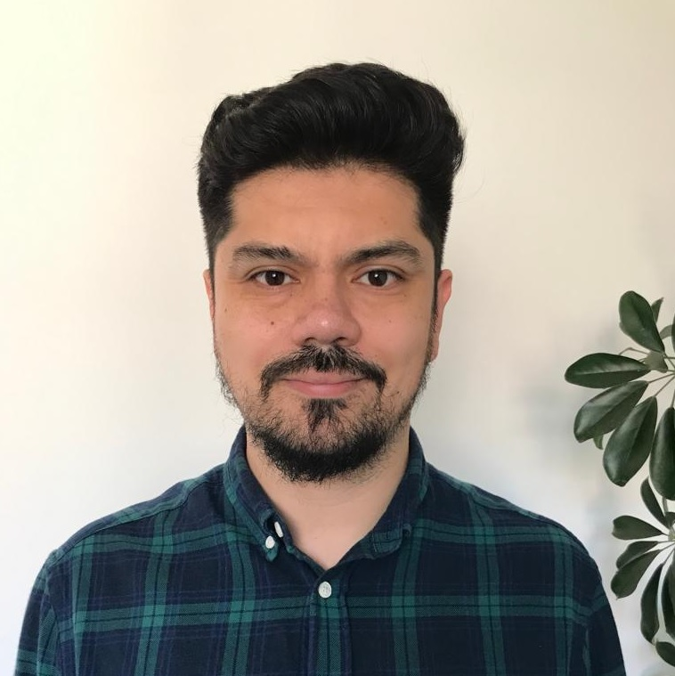

::: {.top-banner}
:::

::: {.language-switch}
[EN](index.qmd) | [ES](index-es.qmd)
:::

::: {.profile-layout}

::: {.profile-left}
{.profile-img}

# Gonzalo Torres Rosales

Psicólogo Social  
Candidato a Doctor en Sociología  
Pontificia Universidad Católica de Chile  

[GitHub](https://github.com/gonzalotr11){.btn .btn-outline-primary}
[LinkedIn](https://www.linkedin.com/in/gonzalo-torres-rosales-38a21068){.btn .btn-outline-primary}
[ORCID](https://orcid.org/0000-0002-9612-2787){.btn .btn-outline-primary}
[Email](mailto:gonzalo.torres11@gmail.com){.btn .btn-outline-primary}
:::

::: {.profile-right}
## Desigualdad Social, Bienestar e Investigación Social Cuantitativa

Soy Psicólogo Social y Candidato a Doctor en Sociología en la Pontificia Universidad Católica de Chile. Mi investigación se centra en la desigualdad social, el bienestar económico y las condiciones que moldean las oportunidades de vida a lo largo del ciclo vital. Me interesa especialmente comprender cómo la riqueza, la seguridad económica y las trayectorias educativas interactúan para reproducir —o mitigar— las desventajas sociales.

Mi trabajo es fundamentalmente interdisciplinario. Integro perspectivas de la sociología, la psicología y la economía para comprender cómo las condiciones estructurales y las experiencias individuales configuran conjuntamente el desarrollo humano y los resultados sociales. Desde el punto de vista metodológico, me especializo en investigación social cuantitativa, combinando encuestas, registros administrativos, diseños longitudinales y enfoques computacionales para estudiar procesos sociales complejos.

Más allá de la academia, mi agenda de investigación ha sido moldeada por la experiencia directa en organizaciones de la sociedad civil, proyectos educativos e investigación aplicada para políticas públicas. Estas experiencias han reforzado mi interés por producir conocimiento que sea al mismo tiempo rigurosamente analítico y socialmente relevante. A través de mi trabajo busco contribuir a una mejor comprensión de los mecanismos que generan desigualdad y aportar evidencia para debates sobre cómo ampliar las oportunidades, la seguridad y el bienestar de las personas.

### Áreas principales

- Desigualdad social y bienestar económico
- Riqueza, seguridad económica y trayectorias educativas
- Métodos cuantitativos, encuestas y registros administrativos
- Investigación interdisciplinaria en sociología, psicología y economía
:::

:::